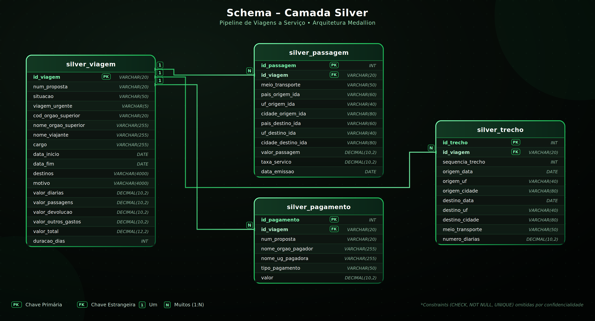
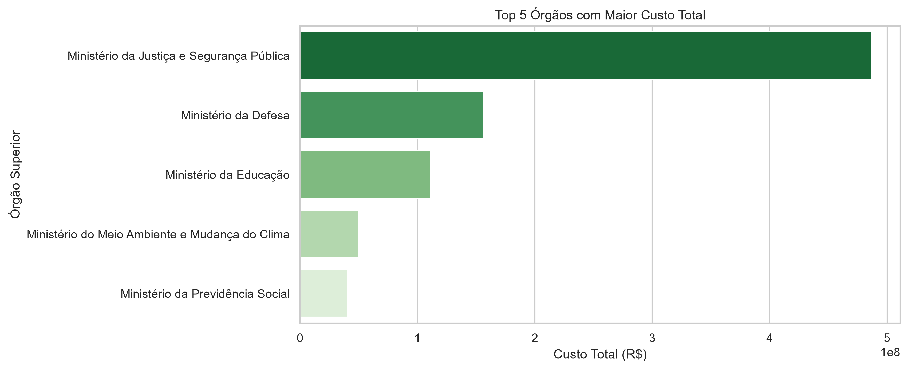
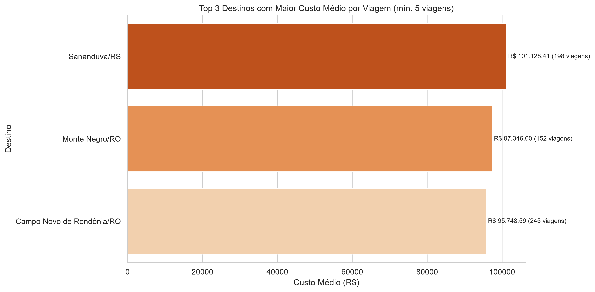
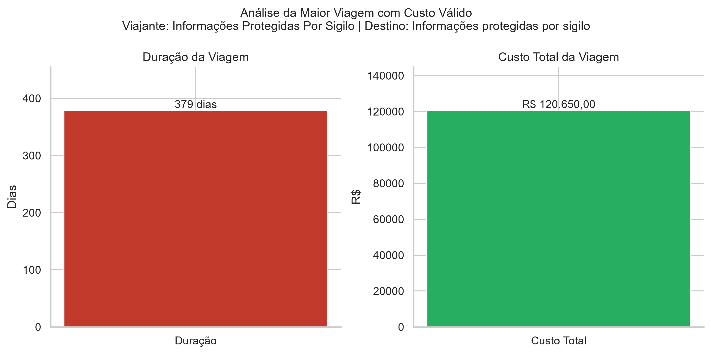
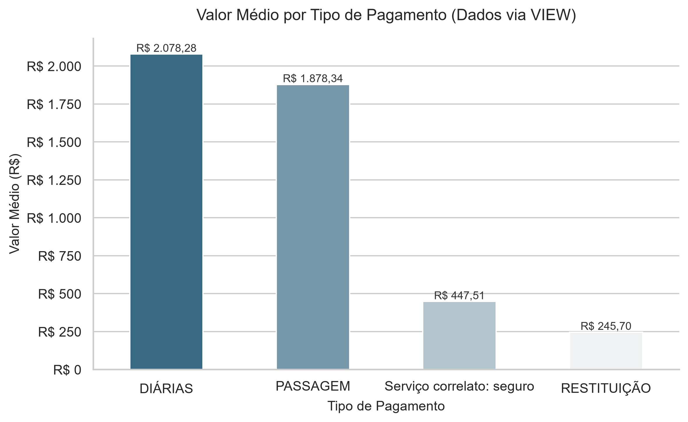
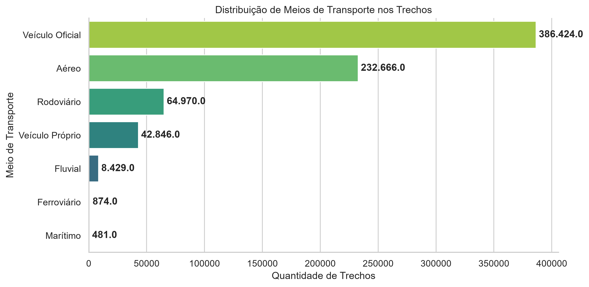
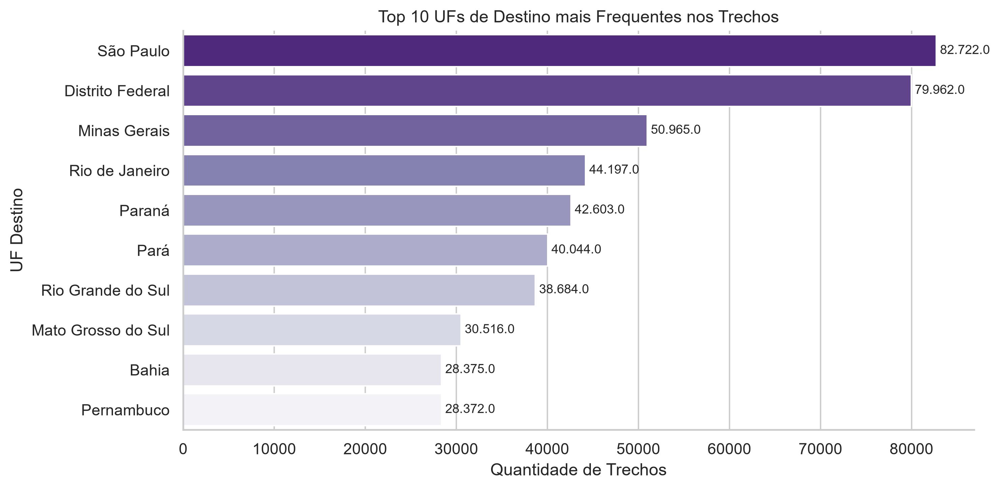
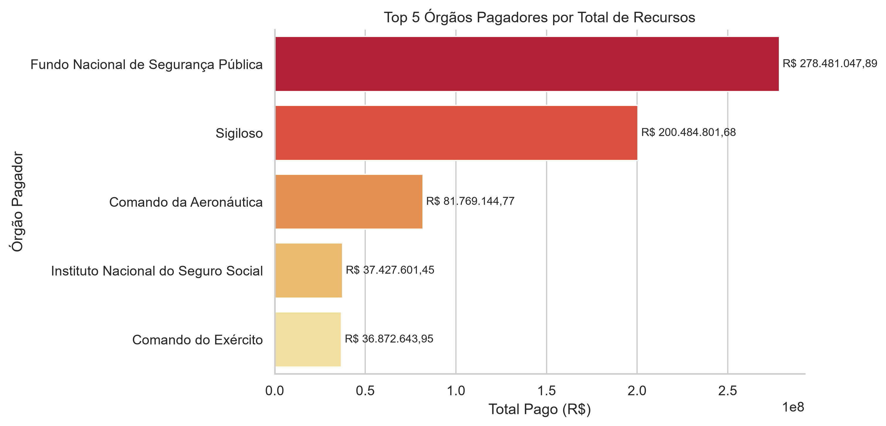

# ✈️ ETL e Pipeline de Viagens do Portal da Transparência  — 3ª Fase: Camada Gold

## 📋 Escopo do Projeto e Resolução do Problema Proposto

Os dados de Viagens a Serviço são publicados pelo Portal da Transparência em sua forma bruta e desorganizados, sem tipagem e sem integridade referencial o que dificulta qualquer análise confiável para tomada de decisão. Este projeto resolve isso construindo um pipeline automatizado que baixa, limpa, tipa e organiza esses dados, respondendo a perguntas de negócio reais sobre os gastos públicos com viagens (órgãos com maior custo, destinos mais caros, meios de transporte mais usados, entre outras).

O presente projeto implementa o processo de ETL e pipeline de dados disponibilizados no padrão de arquitetura **Medallion (Raw → Silver → Gold)** para extrair, transformar, carregar e analisar dados públicos sobre despesas e trechos de viagens realizadas em serviço por servidores do Governo Federal.

O principal objetivo é consolidar dados brutos distribuídos em múltiplos arquivos de origem (como passagens, trechos, pagamentos e viagens), tratando inconsistências, valores ausentes, dados zerados ou negativos.  Entregando, assim, uma **Camada Gold centralizada**. Esta permite responder a perguntas estratégicas de negócio sobre eficiência de custos, meios de transporte e comportamento de despesas públicas, gerando insights visuais claros. E, de maneira automática.

---

# 🛠️ Tecnologias Utilizadas e Técnicas Aplicadas

O ecossistema técnico do projeto foi desenvolvido com tecnologias líderes do mercado de Engenharia de Dados::

- **Linguagem Principal:** Python 3.11
- **Orquestração e ETL:** `pandas` (manipulação e higienização de DataFrames), `os` e `urllib.parse`
- **Armazenamento e Banco de Dados:** PostgreSQL 18 (camadas separadas por convenção de prefixo nas tabelas: `raw`, `silver` e `gold`)
- **Conectividade:** `SQLAlchemy` para execução de queries nativas em alta performance e mapeamento relacional
- **Visualização de Dados e BI:** `Matplotlib` e `Seaborn` para geração automatizada de relatórios gráficos de alta resolução (300 DPI)

O pipeline segue a Arquitetura Medallion, dividida em três camadas:

| Camada           | Descrição                                                                                | Tabelas                                                                         |
| ---------------- | ------------------------------------------------------------------------------------------ | ------------------------------------------------------------------------------- |
| **Raw**    | Cópia fiel dos CSVs originais, sem alteração de conteúdo (todas as colunas`VARCHAR`) | `raw_viagem`, `raw_pagamento`, `raw_passagem`, `raw_trecho`             |
| **Silver** | Dados limpos e tipados (`DECIMAL`, `DATE`), com integridade referencial (PK/FK)        | `silver_viagem`, `silver_pagamento`, `silver_passagem`, `silver_trecho` |
| **Gold**   | Métricas e agregações de negócio, respondendo às perguntas do desafio                 | Tabelas/Views`gold_*`                                                         |

**Tecnologias utilizadas:** Python, PostgreSQL, Pandas, python-dotenv, Jupyter Notebook, Matplotlib/Seaborn (gráficos), Git/GitHub para versionamento.

### 📊Modelagem de Dados na Camada Silver

O diagrama abaixo representa o schema da camada Silver, com chaves primárias (PK), chaves estrangeiras (FK) e a cardinalidade das relações — todas do tipo **1:N**, partindo de `silver_viagem` para `silver_passagem`, `silver_pagamento`e `silver_trecho`:



> As constraints de validação (`CHECK`, `NOT NULL`, `UNIQUE`) estão declaradas diretamente no script `0_criar_banco.sql` e foram omitidas do diagrama.

### 🔒 Constraints Aplicadas na Camada Silver

Além das chaves primárias (PK) e estrangeiras (FK), cada tabela Silver possui 2 constraints adicionais declaradas diretamente no `CREATE TABLE`:

| Tabela               | Constraint 1                            | Constraint 2                                    |
| -------------------- | --------------------------------------- | ----------------------------------------------- |
| `silver_viagem`    | `NOT NULL` em `nome_orgao_superior` | `CHECK` em `valor_diarias >= 0`             |
| `silver_pagamento` | `CHECK` em `valor >= 0`             | `NOT NULL` em `tipo_pagamento`              |
| `silver_passagem`  | `CHECK` em `valor_passagem >= 0`    | `CHECK` em `taxa_servico >= 0`              |
| `silver_trecho`    | `CHECK` em `numero_diarias >= 0`    | `UNIQUE` em `(id_viagem, sequencia_trecho)` |

### ⚙️Camada Raw: Extração e Carga Automatizadas

O script `1_extrair.py` automatiza toda a ingestão dos dados brutos, sem qualquer intervenção manual:

- **Download automatizado:** o arquivo `.zip` é baixado diretamente do Google Drive a partir do `DRIVE_FILE_ID` configurado no `.env`.
- **Leitura em blocos (chunks):** os 4 CSVs (`2025_Viagem`, `2025_Pagamento`, `2025_Passagem`, `2025_Trecho`) são lidos em blocos com Pandas, evitando
  sobrecarga de memória mesmo com arquivos grandes.
- **Preservação fiel dos dados:** todas as colunas são carregadas como `VARCHAR`, sem nenhuma conversão de tipo ou limpeza — mantendo separador `;`, encoding `latin-1`, vírgula como decimal e datas no formato `DD/MM/AAAA` exatamente como publicados, garantindo rastreabilidade e auditoria de qualquer transformação futura.
- **Idempotência:** antes de cada carga, as tabelas Raw passam por `TRUNCATE`, garantindo que reexecuções do pipeline não dupliquem registros.
- **Resiliência:** todo o processo de download e carga é envolto em blocos `try/except`, tratando falhas de conexão ou leitura sem interromper
  silenciosamente o pipeline.
- O resultado são as 4 tabelas Raw (**`raw_viagem`**, **`raw_pagamento`**, **`raw_passagem`**, **`raw_trecho`**) — uma cópia fiel e auditável da fonte oficial,
  que serve de base para a limpeza e tipagem feitas na camada Silver.

### 🛠️ Ajuste Realizado no `config.py` Fornecido

> **Nota sobre o `config.py`:** o arquivo de configuração fornecido foi estendido com o dicionário `COLUNAS_RAW`, que traduz os cabeçalhos originais
> do CSV (com espaços e acentos, ex.: `"Identificador do processo de viagem"`) para nomes de coluna válidos em SQL. Essa extensão foi necessária para atender ao item 5.4 do desafio, que exige a replicação fiel do CSV inteiro na camada Raw — incluindo colunas não usadas na Silver, como `cpf_viajante`, `funcao` e os campos de volta da passagem. Também foram adicionadas as constantes `RAW_SCHEMA` e `SILVER_SCHEMA`, ambas apontando para `public`, padronizando o schema utilizado pelas camadas. Nenhuma configuração original foi removida ou modificada — a alteração é estritamente aditiva.

## 📊 Estrutura dos Dados na Camada Gold

Na **Camada Gold**, os dados foram estruturados de duas formas principais para atender requisitos de negócio distintos:

1. **Tabela Física (`gold.fato_viagens_trechos `)**

   - Resultado de um JOIN + GROUP BY entre silver_viagem e silver_trecho.
   - Agrupa por órgão superior, UF de destino e meio de transporte.
   - Métricas calculadas: quantidade de viagens, quantidade de trechos, duração média (dias) e custo total.
   - Agregando, assim, dados na granularidade de trechos por viagem.

   a) Cuidado de modelagem aplicado:

   - Uma viagem pode ter vários trechos (relação um-para-muitos). Somaro valor_total da viagem diretamente após o JOIN contaria o custo da viagem uma vez por trecho (ex.: viagem com 3 trechos apareceria
     com o triplo do valor real). Solução: usar SUM(v.valor_total) FILTER (WHERE t.sequencia_trecho = 1), contando o custo da viagem uma única vez (via o primeiro trecho como referência), enquanto os demais trechos continuam contando normalmente para as métricas de frequência (transporte, UF).
2. **VIEW Relacional (`gold.vw_financeiro_pagamentos `)**

   - JOIN direto (sem agregação) entre silver_viagem e silver_pagamento.
   - Mantida como view "achatada" (uma linha por pagamento), servindo de base para consultas ad-hoc por pagamento individual nas perguntas de negócio respondidas via SQL direto.
   - Centraliza o rastreio financeiro de órgãos pagadores e tipos de transação sem duplicar dados em disco.

   ***Boas práticas de execução***:

   - Uso de engine.begin() (em vez de connect() + commit() manual): abre transação e garante commit automático em caso de sucesso, ou
     rollback automático em caso de erro.
   - DROP TABLE / DROP VIEW antes de recriar: garante idempotência (rodar a célula novamente não gera duplicidade nem erro de objeto
     já existente).
   - try/except em torno da criação da camada Gold, para não interromper o notebook com um traceback cru caso a camada Silver ainda não
     esteja populada.

---

# 🔐 Tratamento de Dados Sensíveis e Informações Sigilosas

Durante a execução e consolidação da Camada Gold (especificamente na análise da viagem de maior duração), o pipeline se deparou com desafios reais de governança de dados e segurança nacional presentes nas bases do Portal da Transparência.

### 1. Mascaramento por Sigilo Legal

Viagens realizadas por servidores de agências de inteligência (ABIN), segurança pública (Polícia Federal) ou missões de soberania nacional (Ministério da Defesa) têm seus campos de `nome_viajante` e `destinos` protegidos por lei.

O pipeline foi programado para tratar esses textos de forma padronizada (`.title().strip()`), garantindo que o sigilo legal seja respeitado e exibido de forma polida nos relatórios analíticos:

> *"Informações Protegidas Por Sigilo"*

### 2. Limpeza de Registros Nulos/Zerados

O banco de dados original continha viagens longas com custo total registrado como `0.0` (erros de preenchimento ou cancelamentos) e duração em dias em branco.

O pipeline aplicou regras rígidas na query da Camada Gold:

```sql
WHERE valor_total > 0 AND duracao_dias IS NOT NULL
```

Assim, foram descartados ruídos e mantidos apenas registros financeiros válidos e auditáveis.

---

# 📈 Conclusões e Insights das Perguntas de Negócio

Abaixo estão os principais insights derivados das sete perguntas de negócio respondidas pelo arquivo `3_analise.ipynb`.

### 1. Top 5 Órgãos com Maior Custo Total

Identifica quais ministérios e autarquias demandam o maior orçamento para deslocamento de pessoal, permitindo auditorias focadas.



### 2. Os 3 Destinos de Maior Custo Médio por Viagem

Utilizando técnicas de split de texto (`SPLIT_PART`), foram limpos os históricos de escalas para isolar o destino principal.

Isso revelou localidades com maiores custos médios de diárias fora do eixo administrativo comum de Brasília.



### 3. Viagem de Maior Duração e Seu Custo Total (Análise de Outliers)

Localizou de forma precisa uma viagem atípica de **378 dias**, cujo custo totalizado foi de **R$ 120.650,00**.

O valor se mostrou proporcional ao período (cerca de **R$ 319,18 por dia**), demonstrando a capacidade do pipeline de isolar missões contínuas no exterior ou de longo prazo sem distorcer as médias gerais.



### 4. Tipo de Pagamento com Maior Valor Médio

Revelou quais modalidades de repasse financeiro concentram os maiores tickets médios por transação via VIEW analítica.



### 5. Meio de Transporte Mais Utilizado nos Trechos

Para a visualização foi utilizado um **gráfico de barras horizontais** conforme as boas práticas, por tratar grandezas diferentes (*Ferroviário* e *Marítimo*).

O resultado mostrou de maneira inequívoca o predomínio dos meios **Aéreo** e **Rodoviário.**



### 6. Unidade Federativa de Destino Mais Frequente nos Trechos

Mapeamento geográfico de trechos que auxilia na negociação de contratos corporativos de passagens para os estados mais visitados.



### 7. Órgão Pagador com Maior Valor Total Pago no Período

Demonstra a concentração do desembolso de verbas públicas por entidade financeira de origem.



---

# 🚀 Como Executar o Sistema

MySQL ou PostgreSQL rodando localmente (ou em container) e Python 3.10+.

Siga os passos abaixo para implantar e executar o pipeline completo no seu ambiente local utilizando o VS Code e o PostgresSQL.

## 1. Clonar e Organizar as Pastas

Certifique-se de manter a seguinte estrutura de arquivos na raiz do projeto:

```text
.
├── .env
├── .gitignore
├── requirements.txt
├── 0_criar_banco.sql
├── 1_extrair.py
├── 2_transformar.py
├── banco.py
├── config.py
├── 3_analise.ipynb
├── viagens_2025_6meses.zip
├── data/
|       ├── arquivo_1.csv
|       ├── arquivo_2.csv
|       ├── arquivo_3.csv
|       └── arquivo_n.csv
└── imagens/
		   ├── schema_camada_silver.png
           ├── Gráfico_1.png
           ├── Gráfico_2.png
           ├── Gráfico_3.png
           └── Gráfico_n.png
```

---

## 2. Configurar as Variáveis de Ambiente (.env)

Crie um arquivo `.env` na raiz do projeto e preencha com as credenciais do seu banco PostgreSQL.

```env
POSTGRES_HOST=localhost
POSTGRES_PORT=5432
POSTGRES_USER=postgres
POSTGRES_PASSWORD=a sua senha(senha_segura)
POSTGRES_DATABASE=transparencia
```

---

## 3. Instalações e Dependências

Abra o terminal do VS Code e execute:

```bash
pip install -r requirements.txt
```

---

## 4. Executar os Scripts em Sequência

### Execute o script SQL

No PostgresSQL, use o **pgAdmin 4** e crie um banco chamado transparencia, em seguida, execute oa passos abaixo:

```text
0_criar_banco.sql
```

### Execute a extração dos dados

```bash
python 1_extrair.py
```

### Execute a transformação (Camada Silver)

```bash
python 2_transformar.py
```

### Execute a análise

Abra o arquivo:

```text
3_analise.ipynb
```

No VS Code:

- selecione o Kernel Python no canto superior direito;
- clique em **Run All (Executar Tudo)**.

> **Nota:** Ao finalizar a execução do notebook, os sete gráficos analíticos serão gerados automaticamente e salvos como arquivos `.png` de alta qualidade na pasta `imagens/`.

---

# 🔧Melhorias Futuras

Para evolução deste ecossistema de dados, as seguintes melhorias de engenharia podem ser ser aplicadas:

### Modularização de Queries

Mover as queries SQL de strings embutidas para arquivos `.sql` separados, melhorando a manutenção do código.

### Orquestração com Airflow/Prefect

Substituir as execuções manuais por uma esteira automatizada com controle de falhas e retentativas.

### Testes de Qualidade de Dados (Great Expectations)

Implementar asserções automáticas para impedir a entrada de dados zerados ou negativos na Camada Silver.

### Automatização de Testes

Testes automatizados (pytest) para as etapas de transformação

### Geração de DashBoards

Deploy da camada Gold em um dashboard (Streamlit, Power BI ou Metabase)

### Otimização na Execução

Ingestão incremental (apenas novos registros), em vez de carga completa

---

# 🌱 Versionamento

Projeto versionado com Git, seguindo commits no imperativo e descritivos (ex.: `implementa extração da camada Raw`, `corrige tipagem de datas`), com
branches por funcionalidade desenvolvida.
